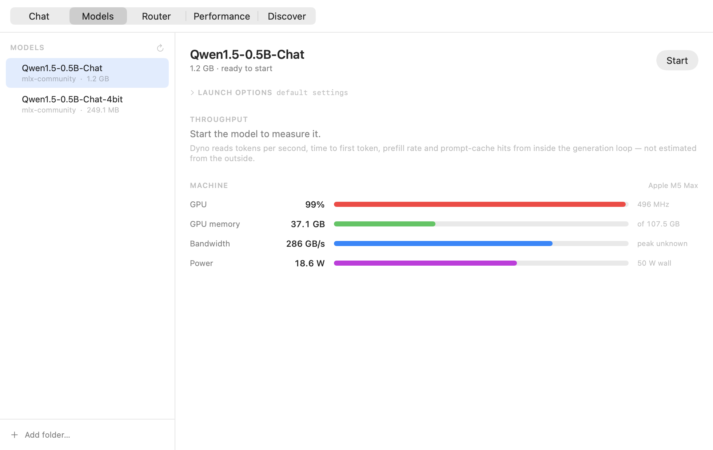

# MLX Dyno

**Put your model on the dyno.**

An MLX inference server for Apple Silicon that reports what it is actually
doing — tokens per second, time to first token, prefill throughput, queue wait
and prompt-cache hits — plus a native menu bar app that shows those beside the
machine's own GPU, power and unified-memory telemetry.

📖 **[canivel.github.io/mlx-dyno](https://canivel.github.io/mlx-dyno/)**



| | What it is |
|---|---|
| **`dyno serve`** | MLX inference server reporting its own throughput over `/metrics` and `/stats`. OpenAI-compatible. |
| **Dyno.app** | Native Swift menu bar app. Starts models, shows their metrics and the machine's. |
| **`dyno top`** | Terminal dashboard for the hardware metrics alone, with JSON and CSV output. |

## Why this exists

Running a large model locally on a Mac is mostly a memory problem, and the
tools do not show you memory the way it matters.

There is no `nvidia-smi` on macOS. Activity Monitor reports a GPU percentage
that cannot tell a GPU pinned at a low clock apart from one doing real work,
and reports memory used without reference to the only ceiling that counts: how
much unified memory Metal will actually let the GPU hold. On a 128 GB machine
that is 107.5 GB, not 128. Cross it and allocations quietly spill back to CPU
memory, throughput falls off a cliff, and nothing tells you why.

Then there is throughput itself. Token generation is memory-bound — every token
re-reads the entire weight set — so tokens per second is set by bandwidth, not
by GPU utilisation. A GPU reading 99% busy while pulling 250 GB/s and one
pulling 400 GB/s are different machines having very different days.

llama.cpp and vLLM both publish Prometheus metrics, so anyone can read their
real throughput. On Apple Silicon the fast path is MLX — and `mlx_lm` computes
throughput internally on every single request, then discards it. Anything
watching from outside has to infer it.

You can infer it, up to a point. Read bandwidth divided by weight-set size gives
the decode rate, and on a 27B 8-bit model on an M5 Max that predicted 8.97
tok/s against 8.70 measured: within 3%. But the moment a second request shared
the GPU, the same estimate read ~10.3 against 8.73 actual. An estimate that is
excellent in isolation and 18% high under load is not something to benchmark
against, tune a batch size with, or decide a quantisation level on.

So expose the number instead of guessing it. The measurement happens inside the
token stream, where it is simply a fact rather than an inference.

## Install

**Requirements to build:** macOS 14+ on Apple Silicon, Xcode's Swift toolchain
(`xcode-select --install`), and [uv](https://docs.astral.sh/uv/) — which supplies
the Python that gets bundled. *The finished app needs none of these.*

```sh
git clone https://github.com/canivel/mlx-dyno
cd mlx-dyno/app
./build.sh                          # ~12 seconds, produces a 390 MB bundle
cp -r build/Dyno.app /Applications/
open /Applications/Dyno.app
```

That is the whole install. **Python and MLX ship inside the app**, so there is
nothing to `pip install` and no terminal needed afterwards.

Dyno lives in the menu bar — no Dock icon. **Click the menu bar icon to open
the app**; right-click it for a summary without leaving what you are doing.

## Using it

Four tabs:

**Chat** — conversations on the left, the thread in the middle. Every reply
carries the tokens/sec and time to first token that produced it, read from the
server's counters rather than timed from outside. Reasoning models show their
thinking in a collapsible block, because mlx_lm reports it in its own field
rather than inline. The model picker at the top means a conversation can be
continued on a different model, and conversations are saved to disk.

**Models** — your library, with **Start**. Launch options are one disclosure
away: max tokens, prompt-cache size, decode and prompt concurrency, sampling
defaults, speculative decoding. Only settings you actually change are passed, so
untouched ones stay whatever mlx_lm considers correct.

**Performance** — GPU load, tokens/sec, memory bandwidth, GPU power, GPU memory
and wall power charted over time, with the server's own counters (requests,
tokens, TTFT, prefill rate, prompt-cache hit rate) and the processes competing
for the GPU.

**Router** — see below.

**Discover** — search the Hugging Face hub and download in one click.

## The router

```sh
dyno route
```

One OpenAI-compatible endpoint in front of every model you have running.
Point any client at `127.0.0.1:8970` with model `"auto"` and it picks.

What makes a *local* router different from OpenRouter is that the constraint is
memory, not money. Only two or three large models fit at once, reaching a
non-resident one costs tens of seconds of loading, and cost is measured in
seconds and watts. Dyno already knows which models are resident, how much
headroom is left and how fast each one actually runs, so it can decide on facts
rather than a price list.

Four mechanisms, in the order they get a say:

1. **Explicit rules** — readable and predictable, no model call. Match on
   length, a regex or a keyword; send to a tier or a named model.
2. **Self-routing** — the first turn goes to the strongest model, which then
   tags the conversation's difficulty; later turns follow the tag. The tagging
   call happens after the answer is already on its way back, so it costs the
   turn that pays for it nothing.
3. **Residency-aware cost** — among models clearing a tier, pick the one that
   will actually finish first, from measured throughput, queue depth and the
   load time a non-resident model would cost.
4. **Confidence escalation** — the model's own token probabilities say whether
   it was guessing. Below the threshold, retry on the next model up.

Every decision is recorded with the candidates it rejected and why, visible in
the Router tab or at `/routes`. A router you cannot interrogate is one you end
up switching off.

```
14:22:07  "Prove the halting problem is undecidable…"    8.6s
  ↗ Qwen3.8-27B-MLX-4bit   self-routing  easy  confidence 0.64
     escalated from Qwen1.5-0.5B-Chat —
     mean token probability 0.64 below 0.75
```

The escalation threshold is calibrated rather than round: measured on
Qwen1.5-0.5B, a question it handled well scored **0.95** and one well beyond it
scored **0.64**, so the default sits at 0.75 between them.

```sh
dyno route --list                        # what it can see, strongest first
dyno route --backend 8971 --backend 8972 # only these
dyno route --rules rules.json            # explicit rules
dyno route --escalate-below 0            # never escalate
dyno route --trace-file routes.jsonl     # append every decision
```

Under it all, an OpenAI-compatible endpoint on `127.0.0.1:8971` that any client
can point at.

Point any OpenAI client at it:

```sh
curl http://127.0.0.1:8971/v1/chat/completions \
  -H 'Content-Type: application/json' \
  -d '{"model":"<model>","messages":[{"role":"user","content":"hi"}]}'
```

Quit the app and the server stops with it, so a model is never left holding
tens of gigabytes.

<details>
<summary>Troubleshooting</summary>

`Dyno.app/Contents/MacOS/Dyno --diagnose` prints which runtime the app resolved
and which models it can see; add `--start` to actually launch the first one.

`--snapshot <dir>` renders the UI to PNG without launching the app.

`./build.sh --slim` skips the bundled runtime for faster rebuilds; a slim build
falls back to a `dyno` CLI on your `PATH`.

</details>

### Just the command line

The Python half stands alone, for scripting or a headless box:

```sh
uv tool install 'mlx-dyno[serve]'    # dyno pull / serve / top
uv tool install mlx-dyno             # dyno top only; rich is the sole dependency
```

## Serving from the command line

```sh
dyno serve --model mlx-community/Qwen3-8B-4bit --port 8971
```

```
MLX Dyno 0.1.0  ·  serving with live metrics
  OpenAI API   http://127.0.0.1:8971/v1
  Metrics      http://127.0.0.1:8971/metrics   (Prometheus)
  Stats        http://127.0.0.1:8971/stats     (JSON)
```

### Not a fork

`dyno serve` imports `mlx_lm.server`, swaps two classes for instrumented
subclasses, and hands control back. Every existing flag keeps working, and so do
mlx_lm's batching, prompt caching and speculative decoding. The additions are
timing hooks inside the token stream and two endpoints.

Hooking the token stream rather than the HTTP layer means streaming and
non-streaming requests are measured identically.

## The metrics

| Metric | Meaning |
|---|---|
| `mlx:decode_tokens_per_second` | In-flight throughput; falls back to recent history when idle |
| `mlx:live_decode_tokens_per_second` | Requests generating right now, summed |
| `mlx:last_time_to_first_token_seconds` | Prompt processing plus queue wait |
| `mlx:last_prompt_tokens_per_second` | Prefill throughput |
| `mlx:cached_prompt_tokens_total` | Prompt tokens the cache served |
| `mlx:tokens_generated_total`, `mlx:prompt_tokens_total` | Cumulative counters |
| `mlx:requests_active`, `mlx:requests_total`, `mlx:requests_failed_total` | Request state |
| `mlx:memory_active_bytes`, `_peak_bytes`, `_cache_bytes` | MLX allocator |
| `mlx:model_load_seconds`, `mlx:uptime_seconds` | Server state |

The decode rate deliberately excludes prompt processing and queue time: it is
tokens produced divided by the time spent producing them, which is the number
that answers "how fast does this model generate". Verified against wall-clock
timing — a request that took 5.46 s end to end with 0.36 s to first token
reported 31.2 tok/s, exactly `159 ÷ 5.10`.

`/stats` returns the same figures as JSON, plus the last ten requests
individually (queue wait, TTFT, prefill rate, decode rate, cache hits, finish
reason).

## Other runtimes

The app is not MLX-only. It also reads:

- **llama.cpp** — `/props` for the model, `/metrics` for measured throughput
  (start it with `--metrics`)
- **vLLM** — `/metrics`
- **Ollama** — `/api/ps` for resident models and their VRAM
- **LM Studio** and anything OpenAI-compatible — `/v1/models`

For a runtime that reports no throughput, the app estimates it from memory
bandwidth and always marks it `≈ est.`, showing `—` rather than a number
whenever more than one model is loaded and bandwidth cannot be attributed.

## Machine metrics

No `sudo`, ever. Most Apple Silicon monitors shell out to `powermetrics`, which
needs root; this reads the same counters one level down through `IOReport`,
IOKit and Metal, all readable by a normal user.

- **GPU** busy percentage from P-state residency, and the clock averaged over
  busy time only — a GPU pinned at 100% on a low clock is power- or
  thermally-limited, not working hard.
- **GPU memory** against Metal's `recommendedMaxWorkingSetSize`, the real
  ceiling for weights plus KV cache.
- **Memory bandwidth**, estimated from the controller's histogram — quantised to
  the bucket width, and labelled as an estimate.
- **Power** for the GPU, CPU, DRAM and Neural Engine rails separately, the SoC
  total, and wall draw against the adapter's rating.

`Device Utilization %` from the IOKit accelerator node, which several other
tools report as GPU usage, is unreliable on recent macOS — it reads near 100% on
an idle machine. This ignores it in favour of P-state residency.

```sh
dyno pull <repo-id>            # download a model from the hub
dyno top                       # live dashboard
dyno top --once                # one snapshot
dyno top --json                # newline-delimited JSON
dyno top --csv run.csv -i 0.5  # log a benchmark run
```

## Why is the server Python if the app is native?

The app *is* native — all of it. GPU residency, power rails, memory, bandwidth,
process scanning, model discovery, server supervision and the entire UI are
Swift, with no Python anywhere near them. And you never install Python yourself:
it lives inside the app bundle, the same way Ollama ships its own runtime.

The inference server is Python because that is where MLX's model support lives.
`mlx_lm` ships 119 model files — Llama 4, DeepSeek V3.2, Gemma 4, GLM-4, Qwen,
GPT-OSS, Kimi and the rest — with Hugging Face tokenizers, chat templates,
quantisation, batching, prompt caching and speculative decoding, and it picks up
new architectures within days of release. `mlx-swift` can run models natively in
Swift, but reimplementing that surface would mean tracking upstream by hand
forever, and the result would support a fraction of the models.

So the server runs as a *child process*, never embedded: a model load that runs
out of memory cannot take the monitor down with it.

## Layout

```
src/dyno/
  cli.py           the `dyno` entry point
  serve/           the instrumented MLX server
  monitor/         hardware telemetry and the terminal dashboard
app/
  Sources/DynoKit/ IOReport, IOKit, libproc, Metal, model + server discovery
  Sources/Dyno/    SwiftUI menu bar app
  Sources/probe/   command-line harness for the metrics layer
  build.sh         compiles and assembles Dyno.app
docs/              the GitHub Pages site
```

`app/.build/release/probe` prints the Swift layer's raw readings, which is the
quickest way to check what the app is seeing.

## Compatibility

`dyno serve` needs `mlx-lm >= 0.28` and hooks three internals of
`mlx_lm.server` (`ResponseGenerator`, `_run_http_server`, `ModelProvider.load`).
Those are checked at start-up: if a future mlx_lm reshapes them it fails loudly
rather than serving without metrics.

## License

MIT
